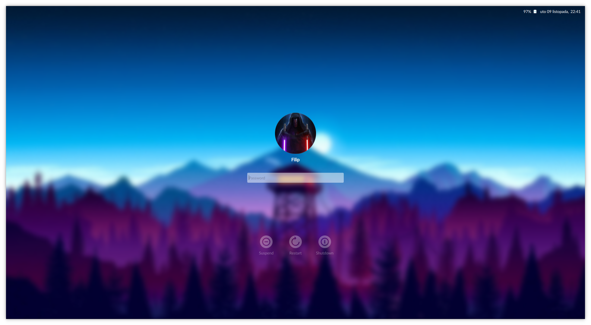

# Fili's Chili login theme for KDE Plasma



Fili's Chili is mereley an adaptation of the [Chili theme](https://github.com/MarianArlt/kde-plasma-chili) (version 0.5.2) based on my personal preferences and for my personal use.

*optimized for a 15" FHD screen = it will look too big on a normal screen*

This means:
- Lato as the default font -> match the font in the session
- Usernames are bolded -> aesthetic preference
- Font hinting is turned off -> hinting distorts typefaces 
(the alternative may be copy fontconfig from .config into var/lib/sddm/.conf, but I am not sure this works 100%)
- Fontsizes changed to 10pt, the username is 11pt > they seemed too big before
- Action buttons' icon size set to 48px -> they seemed to small 
- The height of the password box is slightly reduced -> it was disproportionate with the height of the text in it
- The opacity of unselected action buttons is increased from 60% to 70% -> aesthetic preference

Note: the icons have to be changed according to [these tips](https://bugs.kde.org/show_bug.cgi?id=395027#c10) (Manjaro users should change system.svgz in the ```/usr/share/plasma/desktoptheme/breath/icons``` folder

### License

This project is licensed under the GPLv3 License - see the [LICENSE](LICENSE.md) for details

### Acknowledgments

Naturally the credit goes to [Marian Arlt](https://github.com/MarianArlt) for providing the base theme.

